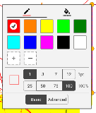
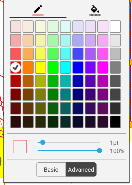
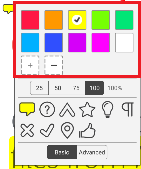
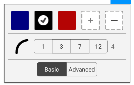
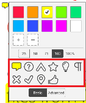

# Customize color in tool color picker board

The color picker board styles are located in `res/values/arrays.xml`, you can customize them by overriding them.

## Standard colors
Used in the color picker **Basic** page.

resource name: `R.array.standard_colors`

## Advance colors
Used in the color picker **Advanced** page with more colors.

resource name: `R.array.advance_colors`

## Icon colors
Used for [StickyNote](https://www.pdftron.com/pdfnet/mobile/docs/Android/pdfnet/javadoc/reference/com/pdftron/pdf/annots/Text.html) annotation to change sticky note icon color.

resource name: `R.array.icon_colors`

## Signature colors
Used for changing colors for [Signature]() tool.

resource name: `R.array.signature_colors`

## Sticky note icons
Used for selecting icons for [StickyNote](https://www.pdftron.com/pdfnet/mobile/docs/Android/pdfnet/javadoc/reference/com/pdftron/pdf/annots/Text.html) annotation. For each annotation icon, it stores two identical icons, one for filling color, and the other for outline.

resource name: `R.array.stickynote_icons`

Corresponding drawable resource: `R.drawable.annotaiton_note_icon_{$icon-name}_fill` and `R.drawable.annotation_note_icon_{$icon-name}_outline`

