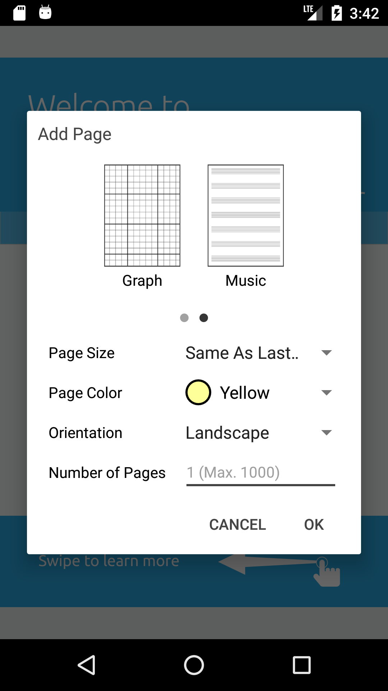

# Add page dialog

Add page dialog allows users either to add new pages to an existing document or to create a new document with new pages with ease. The new pages can have various page options including page type, page size and page color.

")



# Page options
There are three options for pages to be created:

### page type
Currently 5 different types of page are supported in this dialog:
- Black
- Lined
- Grid
- Graph
- Music

### page size
Currently the following page sizes are supported in this dialog:
- Custom
- Letter
- Legal
- A4
- A3
- Ledger

Note that `Custom` option is only available when new pages should be added to an existing PDF document but not when new document should be created. In this case the size of new pages is given when creating the dialog.

### page color 
Three colors can be selected for the page background:
- White
- Yellow
- Blueprint

## Add pages to a new document

If you like to show the add page dialog fragment where the user can create a new document with different choices for new pages, call `newInstance` and override `onCreateNewDocument(PDFDoc, String)` method in `OnCreateNewDocumentListener` interface. The implementation should create a new file with the given title filled out with the given PDF doc.

##### Example
 ```java
void addPagesToNewDocument(@NonNull FragmentManager fragmentManager, @NonNull final String folder) {
    AddPageDialogFragment.newInstance()
        .setOnCreateNewPageListener(new AddPageDialogFragment.OnCreateNewDocumentListener() {
            @Override
            public void onCreateNewDocument(PDFDoc doc, String title) {
                if (doc == null || title == null) {
                    return;
                }
                try {
                    if (!FilenameUtils.isExtension(title, "pdf")) {
                        title = title + ".pdf";
                    }
                    File documentFile = new File(folder, title);
                    doc.save(documentFile.getAbsolutePath(), SDFDoc.e_remove_unused, null);
                    doc.close();
                } catch (PDFNetException e) {
                    e.printStackTrace();
                }
            }
        })
        .show(fragmentManager, "add_page_dialog");
}
 ```

## Add pages to the current document

If you want to add new pages to the current document, you should create a new instance of the add page dialog fragment using `newInstance(double, double)` and provide the valid page width and page height parameters. This parameters will be used if the user select `Custom` in page size dropdown option. You also must implement `OnAddNewPagesListener` interface and override `onAddNewPages(Page[])` where the implementation should add the given pages to the current document.

##### Example
```java
void addPagesToCurrentDocument(@NonNull FragmentManager fragmentManager, @NonNull PDFViewCtrl pdfViewCtrl) {
    boolean shouldUnlockRead = false;
    final WeakReference<PDFViewCtrl> pdfViewCtrlRef = new WeakReference<>(pdfViewCtrl);
    try {
        pdfViewCtrl.docLockRead();
        shouldUnlockRead = true;
        // enable user to add new pages with the same size as the last page in the document
        Page lastPage = pdfViewCtrl.getDoc().getPage(pdfViewCtrl.getDoc().getPageCount());
        AddPageDialogFragment addPageDialog = AddPageDialogFragment.newInstance(lastPage.getPageWidth(), lastPage.getPageHeight());
        addPageDialog.setOnAddNewPagesListener(new AddPageDialogFragment.OnAddNewPagesListener() {
            @Override
            public void onAddNewPages(Page[] pages) {
                PDFViewCtrl pdfViewCtrl = pdfViewCtrlRef.get();
                if (pages == null || pdfViewCtrl == null) {
                    return;
                }
                PDFDoc doc = pdfViewCtrl.getDoc();
                if (doc == null) {
                    return;
                }

                boolean shouldUnlock = false;
                try {
                    pdfViewCtrl.docLock(true);
                    shouldUnlock = true;
                    List<Integer> pageList = new ArrayList<>();
                    for (int i = 1, cnt = pages.length; i <= cnt; i++) {
                        int newPageNum = pdfViewCtrl.getCurrentPage() + i;
                        pageList.add(newPageNum);
                        doc.pageInsert(doc.getPageIterator(newPageNum), pages[i - 1]);
                    }

                    // For undo/redo support when tool manager is attached to the PDFViewCtrl
                    ToolManager toolManager = (ToolManager) pdfViewCtrl.getToolManager();
                    if (toolManager != null) {
                        toolManager.raisePagesAdded(pageList);
                    }
                } catch (Exception e) {
                    e.printStackTrace();
                } finally {
                    if (shouldUnlock) {
                        pdfViewCtrl.docUnlock();
                    }
                    try {
                        pdfViewCtrl.updatePageLayout();
                    } catch (PDFNetException e) {
                        e.printStackTrace();
                    }
                }
            }
        });
        addPageDialog.show(fragmentManager, "add_page_dialog");
    } catch (Exception e) {
        e.printStackTrace();
    } finally {
        if (shouldUnlockRead) {
            pdfViewCtrl.docUnlockRead();
        }
    }
}
```