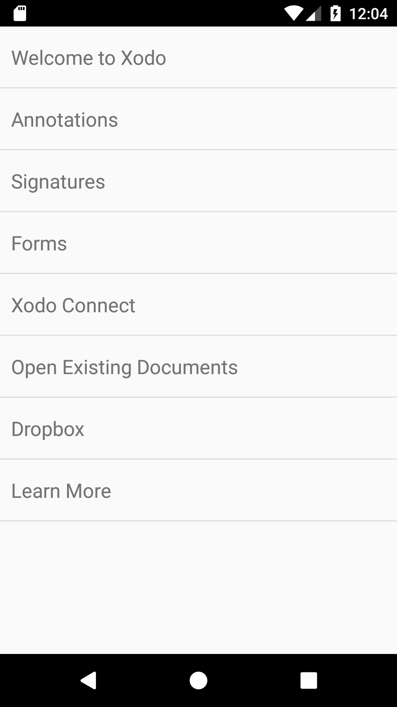

# Outline dialog fragment

This class shows a a document outline (bookmarks) that can be used to navigate through the document being viewed by a PDFViewCtrl.



To create a new instance of the outline dialog fragment call `newInstance()` and set the PDFViewCtrl: 
```java
OutlineDialogFragment showOutlineDialog(FragmentManager fragmentManager, PDFViewCtrl pdfViewCtrl) {
    OutlineDialogFragment outlineDialogFragment = OutlineDialogFragment.newInstance();
    outlineDialogFragment.setPdfViewCtrl(pdfViewCtrl);
    outlineDialogFragment.show(fragmentManager, "outline_dialog");
    return outlineDialogFragment;
}
```

You can also sets the current bookmark using `setCurrentBookmark(Bookmark)'.

You should set a listener via `setOutlineDialogListener(OutlineDialogListener)` to be notified when an outline is clicked.
