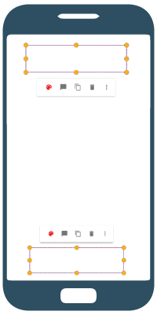

# Quick menu

A menu Layout that can be shown in [PDFViewCtrl](https://www.pdftron.com/pdfnet/mobile/docs/Android/pdfnet/javadoc/reference/com/pdftron/pdf/PDFDoc.html). It shows a small menu layout with maximum two rows, and a overflow menu list. 


With a given anchor rectangle view, quick menu will auto adjust position, it will be shown in either at the top of the anchor view or at the bottom of the anchor view:



## Table of Contents  
1. [ Add quick menu resource](#add-quick-menu-resource-in-resmenu-folder)
2. [ Add quick menu submenu](#add-quick-menu-submenu)
3. [Show quick menu](#show-quick-menu)
4. [Quick menu item OnClick event listener](#get-quick-menu-clicked-menu-item)
5. [Override exsiting tool menu](#overriding-existing-tool-quick-menu-resource)
6. [Styles](#styles)

## Add quick menu resource in `res/menu` folder
By default, all menu items are placed in the first row, if you want to specifies where the menu item is, you can simply put the menu items inside a group with the following group id.

####`@id/qm_first_row_group`

first row group id. All menu items inside this group will be displayed in first row of quick menu.

####`@id/qm_second_row_group`

second row group id. All menu items inside this group will be displayed in first row of quick menu.

####`@id/qm_overflow_row_group`

overflow list group id. All menu items inside this group will be displayed in overflow menu list of quick menu.

Example
```xml
<?xml version="1.0" encoding="utf-8"?>
<menu xmlns:android="http://schemas.android.com/apk/res/android">
    <group android:id="@id/qm_first_row_group">
        <item android:id="@+id/qm_rectangle"
            android:title="@string/tools_qm_rectangle"
            android:icon="@drawable/annotation_square" />
    </group>
    <group android:id="@id/qm_second_row_group">
        <item android:id="@+id/qm_line"
            android:title="@string/annot_line"
            android:icon="@drawable/annotation_line"/>
        <item android:id="@+id/qm_free_text"
            android:title="@string/annot_free_text"
            android:icon="@drawable/annotation_free_text"/>
    </group>
    <group android:id="@id/qm_overflow_row_group">
        <item android:id="@+id/qm_floating_sig"
            android:title="@string/tools_qm_signature"/>
        <item android:id="@+id/qm_link"
            android:title="@string/annot_link"/>
    </group>
</menu>

```

## Add quick menu submenu
If you want display another quick menu after you clicked on one quick menu item, you can add a submenu under that quick menu in menu resource

```xml
<?xml version="1.0" encoding="utf-8"?>
<menu xmlns:android="http://schemas.android.com/apk/res/android">
    <group android:id="@id/qm_first_row_group">
        <item android:id="@+id/qm_rectangle"
            android:title="@string/tools_qm_rectangle"
            android:icon="@drawable/annotation_square" >
            <!-- Show "Link" after clicked on "Rectangle" quick menu item -->
            <menu>
                <group android:id="@id/qm_first_row_group">
                    <item android:id="@+id/qm_link"
                    android:title="@string/annot_link"/>
                </group>
            </menu>
        </item>
    </group>
</menu>
```


## Show quick menu
After creating a quick menu, quick menu can simply inflate menu resource and initialize menu items by calling [`quickMenu.initMenuEntries(@MenuRes int)`]().

```java
    QuickMenu quickMenu = new QuickMenu(mPdfViewCtrl);
    quickMenu.initMenuEntries(R.menu.qm_resources);
```

Alternatively, If you want to change menu items before quick menu initialize them, you can call [`quickMenu.inflate(@MenuRes int)`](), so it won't auto initialize menu items. After adjusting menu items, you can call [`quickMenu.initMenuEntries()`]() to initialize menu items.

```java
    QuickMenu quickMenu = new QuickMenu(mPdfViewCtrl);
    quickMenu.inflate(R.menu.annot_simple_shape);
    QuickMenuItem noteItem = (QuickMenuItem) quickMenu.getMenu().findItem(R.id.qm_note);
    if (noteItem != null) {
        noteItem.setIcon(R.drawable.annotation_sticky_note);
        noteItem.setTitle(R.string.tools_qm_add_note);
    }
    quickMenu.initMenuEntries();
```

After quick menu initialized, you can set position of screen position of quick menu abd show quick menu by calling [`quickMenu.setAnchorRect(RectF)`](), and [`quickMenu.show()`]().

```java
    quickMenu.setAnchorRect(anchor_rect);

    quickMenu.show();
```

## Get quick menu clicked menu item
When quick menu item is clicked, it will dismiss the quick menu popup. You can set a dismiss listener and get the selected menu item as following:
```java
    quickMenu.setOnDismissListener(new QuickMenu.OnDismissListener() {
        @Override
        public void onDismiss() {
            // get selected quick menu item
            QuickMenuItem selectedMenuItem = quickMenu.getSelectedMenuItem();
        }
    });
```


#### *Additional Tips:*
##### 
- If your quick menu is controlled by your [custom tool](/android/guides/advanced/custom-tool), you can simply overriding [`Tool.onQuickMenuClicked(QuickMenuItem)`]() in your custom tool to listen to quick menu click event.
##### 
- If you overrides existing Tool quick menu resource, you can either:
    - If you are using PdfViewCtrlTabFragment for showing pdf, then add quick menu listener by calling: [`PdfViewCtrlTabFragment.addQuickMenuListener(ToolManager.QuickMenuListener)`]().
    - Or you can call [`ToolManager.setQuickMenuListener(ToolManager.QuickMenuListener)`]()


## Overriding existing [tool](http://neon.pdftron.local:8000/www/qliu/android/api/reference/com/pdftron/pdf/tools/Tool.html) quick menu resource

Some [tools](http://neon.pdftron.local:8000/www/qliu/android/api/reference/com/pdftron/pdf/tools/Tool.html) shows quick menu after some motion event. For instance, in [Pan](http://neon.pdftron.local:8000/www/qliu/android/api/reference/com/pdftron/pdf/tools/Pan.html) tool, when [`onLongPress(MotionEvent)`](http://neon.pdftron.local:8000/www/qliu/android/api/reference/com/pdftron/pdf/tools/Tool.html#onLongPress(android.view.MotionEvent)) is called, it shows a quick menu with many selections. You can overrides the following quick menu resources so the corresponding tools will show different quick menu

| Menu resource             | Tool   | Triggered event |
|---------------------------| ------ | --------------- |
| `R.qm_pan`                | [Pan](http://neon.pdftron.local:8000/www/qliu/android/api/reference/com/pdftron/pdf/tools/Pan.html)             | long pressing blank space of documentasd|
| `R.qm_form`               | [Pan](http://neon.pdftron.local:8000/www/qliu/android/api/reference/com/pdftron/pdf/tools/Pan.html)             | Clicked on quick menu item with id `R.id.qm_form`|
| `R.annot_simple_shape`    | [AnnotEdit](http://neon.pdftron.local:8000/www/qliu/android/api/reference/com/pdftron/pdf/tools/AnnotEdit.html) | single tap on annotation ([Square](https://www.pdftron.com/pdfnet/mobile/docs/Android/pdfnet/javadoc/reference/com/pdftron/pdf/annots/Square.html), [Circle](https://www.pdftron.com/pdfnet/mobile/docs/Android/pdfnet/javadoc/reference/com/pdftron/pdf/annots/Circle.html), [Line](https://www.pdftron.com/pdfnet/mobile/docs/Android/pdfnet/javadoc/reference/com/pdftron/pdf/annots/Line.html), [Polygon](https://www.pdftron.com/pdfnet/mobile/docs/Android/pdfnet/javadoc/reference/com/pdftron/pdf/annots/Polygon.html), [Polyline](https://www.pdftron.com/pdfnet/mobile/docs/Android/pdfnet/javadoc/reference/com/pdftron/pdf/annots/PolyLine.html), [Text](https://www.pdftron.com/pdfnet/mobile/docs/Android/pdfnet/javadoc/reference/com/pdftron/pdf/annots/Text.html)) |
| `R.annot_free_text`       | [AnnotEdit](http://neon.pdftron.local:8000/www/qliu/android/api/reference/com/pdftron/pdf/tools/AnnotEdit.html) | single tap on annotation [FreeText](https://www.pdftron.com/pdfnet/mobile/docs/Android/pdfnet/javadoc/reference/com/pdftron/pdf/annots/FreeText.html)|
| `R.annot_link`            | [AnnotEdit](http://neon.pdftron.local:8000/www/qliu/android/api/reference/com/pdftron/pdf/tools/AnnotEdit.html) | single tap on annotation [Link](https://www.pdftron.com/pdfnet/mobile/docs/Android/pdfnet/javadoc/reference/com/pdftron/pdf/annots/Link.html)|
| `R.annot_signature`       | [AnnotEdit](http://neon.pdftron.local:8000/www/qliu/android/api/reference/com/pdftron/pdf/tools/AnnotEdit.html) | single tap on annotation signature (type: [Annot.e_Stamp](https://www.pdftron.com/pdfnet/mobile/docs/Android/pdfnet/javadoc/reference/com/pdftron/pdf/Annot.html#e_Stamp) and sdfobj: [Signature.SIGNATURE_ANNOTATION_ID](http://neon.pdftron.local:8000/www/qliu/android/api/reference/com/pdftron/pdf/tools/Signature.html#SIGNATURE_ANNOTATION_ID))|
| `R.annot_stamper`         | [AnnotEdit](http://neon.pdftron.local:8000/www/qliu/android/api/reference/com/pdftron/pdf/tools/AnnotEdit.html) | single tap on annotation stamp (type: [Annot.e_Stamp](https://www.pdftron.com/pdfnet/mobile/docs/Android/pdfnet/javadoc/reference/com/pdftron/pdf/Annot.html#e_Stamp) and sdfobj: [Stamper.STAMPER_ANNOTATION_ID](http://neon.pdftron.local:8000/www/qliu/android/api/reference/com/pdftron/pdf/tools/Stamper.html#STAMPER_ANNOTATION_ID))|
| `R.annot_file_attachment` | [AnnotEdit](http://neon.pdftron.local:8000/www/qliu/android/api/reference/com/pdftron/pdf/tools/AnnotEdit.html) | single tap on annotation [FileAttachment](https://www.pdftron.com/pdfnet/mobile/docs/Android/pdfnet/javadoc/reference/com/pdftron/pdf/annots/FileAttachment.html)|
| `R.annot_free_hand` | [AnnotEdit](http://neon.pdftron.local:8000/www/qliu/android/api/reference/com/pdftron/pdf/tools/AnnotEdit.html) | single tap on annotation [Ink](https://www.pdftron.com/pdfnet/mobile/docs/Android/pdfnet/javadoc/reference/com/pdftron/pdf/annots/Ink.html)|
| `R.annot_general` | [AnnotEdit](http://neon.pdftron.local:8000/www/qliu/android/api/reference/com/pdftron/pdf/tools/AnnotEdit.html) | single tap on all other annotations|
| `R.qm_annot_edit_text_markup` | [AnnotEditTextMarkup](http://neon.pdftron.local:8000/www/qliu/android/api/reference/com/pdftron/pdf/tools/AnnotEditTextMarkup.html) | single tap on [TextMarkup](https://www.pdftron.com/pdfnet/mobile/docs/Android/pdfnet/javadoc/reference/com/pdftron/pdf/annots/TextMarkup.html) annotations|
| `R.qm_type` | [AnnotEditTextMarkup](http://neon.pdftron.local:8000/www/qliu/android/api/reference/com/pdftron/pdf/tools/AnnotEditTextMarkup.html) | clicked on quick menu item with id `R.id.qm_type` |
| `R.qm_text_select` | [TextSelect](http://neon.pdftron.local:8000/www/qliu/android/api/reference/com/pdftron/pdf/tools/TextSelect.html) | Select text in document|
| `R.qm_sig_field_image` | [DigitalSignature](http://neon.pdftron.local:8000/www/qliu/android/api/reference/com/pdftron/pdf/tools/DigitalSignature.html) | single tap on digital image signature |
| `R.qm_annot_edit_thickness` | [DigitalSignature](http://neon.pdftron.local:8000/www/qliu/android/api/reference/com/pdftron/pdf/tools/DigitalSignature.html) | clicked on quick menu item with id `R.id.qm_thickness`|
| `R.qm_sig_field_paths` | [DigitalSignature](http://neon.pdftron.local:8000/www/qliu/android/api/reference/com/pdftron/pdf/tools/DigitalSignature.html) | single tap on digital signature, or clicked on items in quick menu `R.menu.qm_annot_edit_thickness`|
| `R.qm_sig` | [Signature](http://neon.pdftron.local:8000/www/qliu/android/api/reference/com/pdftron/pdf/tools/Signature.html) | If a custom signature already exsits, show quick menu when creating a signature or when single tapped on a signature field |


### Only show quick menu with exist items:
If you only want to show free text and signature selection in first row when [Pan](http://neon.pdftron.local:8000/www/qliu/android/api/reference/com/pdftron/pdf/tools/Pan.html) tool long pressing event is triggered, you just need to override `R.menu.qm_pan` in your own project as following:

```xml
<?xml version="1.0" encoding="utf-8"?>
<menu xmlns:android="http://schemas.android.com/apk/res/android">
    <item android:id="@+id/qm_free_text"
        android:title="@string/annot_free_text"
        android:icon="@drawable/annotation_free_text" />
    <item android:id="@+id/qm_floating_sig"
        android:icon="@drawable/annotation_signature"
        android:title="@string/tools_qm_signature" />
</menu>
```
Please note: add `@+id/qm_free_text` and `@+id/qm_floating_sig` ids to the quick menu so [Pan](http://neon.pdftron.local:8000/www/qliu/android/api/reference/com/pdftron/pdf/tools/Pan.html) tool can recognize them when quick menu item is clicked.

### Show customized items in quick menu
If you want to add your own quick menu item when [Pan](http://neon.pdftron.local:8000/www/qliu/android/api/reference/com/pdftron/pdf/tools/Pan.html) tool long pressing event is triggered.

`R.menu.qm_pan`:
```xml
<?xml version="1.0" encoding="utf-8"?>
<menu xmlns:android="http://schemas.android.com/apk/res/android">
    <item android:id="@+id/item1"
        android:title="item1"
        android:icon="@drawable/item1_drawable" />
</menu>
```
After you override `R.menu.qm_pan` with your item, you can add your quick menu click event as described [here](/android/guides/basics/quick-menu#-1)

If your activity is using [PdfViewCtrlTabHostFragment](http://neon.pdftron.local:8000/www/qliu/android/api/reference/com/pdftron/pdf/controls/PdfViewCtrlTabHostFragment.html) for showing pdf:

```java
mPdfViewCtrlTabHostFragment.getCurrentPDFViewCtrlFragment()
    .addQuickMenuListener(new ToolManager.QuickMenuListener() {
        @Override
        public boolean onQuickMenuClicked(QuickMenuItem menuItem) {
            if (menuItem.getItemId() == R.id.item1) {
                // do something when R.id.item1 clicked
                return true;
            }
            return false;
        }

        @Override
        public void onQuickMenuShown() {

        }

        @Override
        public void onQuickMenuDismissed() {

        }
    });
```

Otherwise you can set quick menu click listener by [ToolManager.setQuickMenuListener(.ToolManager.QuickMenuListener)](http://neon.pdftron.local:8000/www/qliu/android/api/reference/com/pdftron/pdf/tools/ToolManager.html#setQuickMenuListener(com.pdftron.pdf.tools.ToolManager.QuickMenuListener))

```java
mToolManager.setQuickMenuListener(new ToolManager.QuickMenuListener() {
    @Override
    public boolean onQuickMenuClicked(QuickMenuItem menuItem) {
        if (menuItem.getItemId() == R.id.item1) {
            // do something when R.id.item1 clicked
            return true;
        }
        return false;
    }

    @Override
    public void onQuickMenuShown() {

    }

    @Override
    public void onQuickMenuDismissed() {

    }
});
```


## Styles

### Quick menu item icons

In xml menu resource file, you can set menu item icon by `android:icon`. For set icon style, you can simply sets quick menu item icon by adding `android:iconTint` and icon tint mode by adding `android:iconTintMode` in your menu resource xml file if you supports *API 26*.

Example
```xml
<item android:id="@+id/qm_rectangle"
    android:title="@string/tools_qm_rectangle"
    android:icon="@drawable/annotation_square"
    android:iconTint="@color/fab_dark_blue"
    android:iconTintMode="src_in"/>
```

You can also set quick menu item icon programmably before quick menu initialize them by [`quickMenuItem.setIcon(Drawable)`]() or [`quickMenuItem.setIcon(int)`](). For icon style, you can set icon color by [`quickMenuItem.setIconColor(int)`](), and icon opacity by [`quickMenuItem.setIconOpacity(float)`]().

Example
```java
    QuickMenu quickMenu = new QuickMenu(mPdfViewCtrl);
    quickMenu.inflate(R.menu.annot_simple_shape);
    QuickMenuItem noteItem = (QuickMenuItem) quickMenu.getMenu().findItem(R.id.qm_note);
    if (noteItem != null) {
        noteItem.setIcon(R.drawable.annotation_sticky_note);
        noteItem.setIconColor(mContext.getResources().getColor(R.color.red));
        noteItem.setIconOpacity(0.87);
    }
    quickMenu.initMenuEntries();
```
### Quick menu buttons style
Quick menu is using `R.style.QuickMenuButton` for the buttons style. You can change the style by overriding it.

If you want to change the button style after quick menu is displayed, you can find the button by calling [`quickMenu.findButtonByMenuItem(QuickMenuItem)`](). After that, you can set button style programmably depends on if it is a [ImageButton](https://developer.android.com/reference/android/widget/ImageButton.html) or a [Button](https://developer.android.com/reference/android/widget/Button.html).

Example
```java
    /**
     * Update quick menu appearance item color
     * @param color
     */
    public void updateQuickMenuStyleColor(int color) {
        if (mQuickMenu == null) {
            return;
        }
        // find appearance quick menu item
        QuickMenuItem menuItem = (QuickMenuItem) mQuickMenu.getMenu().findItem(R.id.qm_appearance);
        if (menuItem != null) {
            menuItem.setIconColor(color);
            View button = mQuickMenu.findButtonByMenuItem(menuItem);
            if (button != null) {
                if (button instanceof ImageButton) {
                    ((ImageButton) button).setColorFilter(color, PorterDuff.Mode.SRC_IN);
                } else if (button instanceof Button) {
                    ((Button) button).setTextColor(color);
                }
            }
        }
    }
```

### Background
Quick menu background is using `drawable/quickmenu_bg_rext.xml` for *API 21* and `drawable/quickmenu_bg_rect_old_api` for *API under 21*. You can change the background by overriding these drawable files.

### Divider
There is a hairline divider between menu first row and second row. By default, if both first row and second row exist, divider is `VISIBLE` by default. You can set this hairline divider visibility by calling:
```java
quickMenu.setDividerVisibility(View.INVISIBLE);
```

