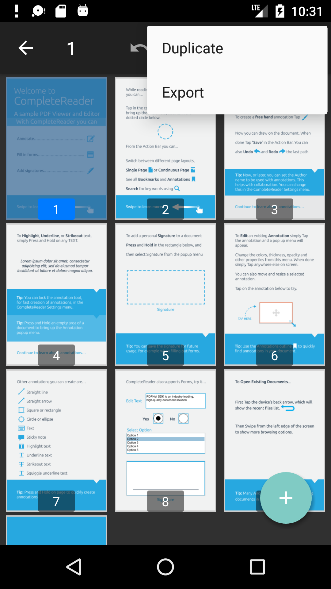

# Page thumbnails dialog fragment

This dialog allows users to edit pages of a document including add, remove, re-arrange, rotate and duplicate pages. Users are also able to undo/redo page manipulations. 

<p align="center"></p>

To create a new instance of the page thumbnails dialog fragment call `newInstance()` and set the PDFViewCtrl: 
```java
ThumbnailsViewFragment showThumbnailsViewDialog(FragmentManager fragmentManager, PDFViewCtrl pdfViewCtrl, boolean isDocReadOnly) {
    ThumbnailsViewFragment thumbnailsViewFragment = ThumbnailsViewFragment.newInstance(isDocReadOnly);
    thumbnailsViewFragment.setPdfViewCtrl(pdfViewCtrl);
    thumbnailsViewFragment.show(fragmentManager, "thumbnails_view_dialog");
    return thumbnailsViewFragment;
}
```

## Export pages
If you would like to allow users to export a subset of pages from the document you should implement `OnExportThumbnailsListener` interface and provide implementation for exporting pages:
```java
thumbnailsViewFragment..setOnExportThumbnailsListener(new ThumbnailsViewFragment.OnExportThumbnailsListener() {
    @Override
    public void onExportThumbnails(SparseBooleanArray pageNums) {
        // The implementation should export given pages.
    }
});
```

If you set `OnExportThumbnailsListener`, the "Export" menu item will show up in the overflow menu when at least one page is selected.

<p align="center"></p>

## Interact with fragment

If you want to be notified when the thumbnails view dialog fragment is dismissed implement `OnThumbnailsViewDialogDismissListener` interface. Also, if you want to be notified when the user attempts to edit pages while the document is read only you should implement `OnThumbnailsEditAttemptWhileReadOnlyListener` interface:

```java
thumbnailsViewFragment.setOnThumbnailsViewDialogDismissListener(new ThumbnailsViewFragment.OnThumbnailsViewDialogDismissListener() {
    @Override
    public void onThumbnailsViewDialogDismiss(int pageNum, boolean docPagesModified) {
        // handle viewer when the thumbnails view dialog is dismissed, for example update the page numbers etc.
    }
});
thumbnailsViewFragment.setOnThumbnailsEditAttemptWhileReadOnlyListener(new ThumbnailsViewFragment.OnThumbnailsEditAttemptWhileReadOnlyListener() {
    @Override
    public void onThumbnailsEditAttemptWhileReadOnly() {
        Toast.makeText(activity, "Read-Only document", Toast.LENGTH_SHORT).show();
    }
});
```