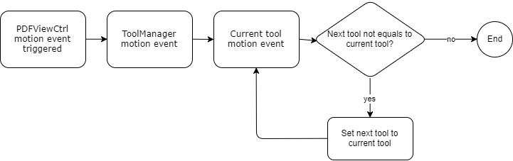

# Tool Overview
[Tool](http://neon.pdftron.local:8000/www/qliu/android/api/reference/com/pdftron/pdf/tools/Tool.html) implements [ToolManager.Tool](http://neon.pdftron.local:8000/www/qliu/android/api/reference/com/pdftron/pdf/tools/ToolManager.Tool.html) for handling all events passed from [ToolManager](http://neon.pdftron.local:8000/www/qliu/android/api/reference/com/pdftron/pdf/tools/ToolManager.html). 
[ToolManager](http://neon.pdftron.local:8000/www/qliu/android/api/reference/com/pdftron/pdf/tools/ToolManager.html) is a class where controls tool changes in each gesture event. When gesture event triggered on [PDFViewCtrl](http://neon.pdftron.local:8000/www/qliu/android/api/reference/com/pdftron/pdf/PDFViewCtrl.html) by [GestureDetector.SimpleOnGestureListener](https://developer.android.com/reference/android/view/GestureDetector.SimpleOnGestureListener.html), [ToolManager](http://neon.pdftron.local:8000/www/qliu/android/api/reference/com/pdftron/pdf/tools/ToolManager.html) passed the gesture events to the [Tool](http://neon.pdftron.local:8000/www/qliu/android/api/reference/com/pdftron/pdf/tools/Tool.html). If currently holded tool sets a different tool mode as next tool mode, after current tool gesture event finished, [ToolManager](http://neon.pdftron.local:8000/www/qliu/android/api/reference/com/pdftron/pdf/tools/ToolManager.html) will let the next tool to continuing current gesture event.

**`// TODO`**

[ToolManager](http://neon.pdftron.local:8000/www/qliu/android/api/reference/com/pdftron/pdf/tools/ToolManager.html) uses [Pan](http://neon.pdftron.local:8000/www/qliu/android/api/reference/com/pdftron/pdf/tools/Pan.html) tool as the default tool which handles almost all user events such as tapping on an annotation, long press to show quick menu, etc. When user tapped on an annotation, [Pan](http://neon.pdftron.local:8000/www/qliu/android/api/reference/com/pdftron/pdf/tools/Pan.html) tool switched to the other corresponding tool so that tool can continue handling the tap event. For example, if Pan tool tapped on a [Link](https://www.pdftron.com/pdfnet/mobile/docs/Android/pdfnet/javadoc/reference/com/pdftron/pdf/annots/Link.html) annotation in [`Pan.onSingleTapConfirmed(MotionEvent)`](http://neon.pdftron.local:8000/www/qliu/android/api/reference/com/pdftron/pdf/tools/Pan.html#onSingleTapConfirmed(android.view.MotionEvent)) event, then Pan tool will set the next tool to be [LinkAction](http://neon.pdftron.local:8000/www/qliu/android/api/reference/com/pdftron/pdf/tools/LinkAction.html) tool. The [Link](https://www.pdftron.com/pdfnet/mobile/docs/Android/pdfnet/javadoc/reference/com/pdftron/pdf/annots/Link.html) annotation will hence be handled by [LinkAction](http://neon.pdftron.local:8000/www/qliu/android/api/reference/com/pdftron/pdf/tools/LinkAction.html) tool in [`LinkAction.onSingleTapConfirmed(MotionEvent)`](http://neon.pdftron.local:8000/www/qliu/android/api/reference/com/pdftron/pdf/tools/LinkAction.html#onSingleTapConfirmed(android.view.MotionEvent)) function. Besides gesture event defined in [ToolManager.Tool](http://neon.pdftron.local:8000/www/qliu/android/api/reference/com/pdftron/pdf/tools/ToolManager.Tool.html) follows the above flow, functions of ToolManager that also follows the above flow includes [ToolManager.onQuickMenuClicked(QuickMenuItem)](http://neon.pdftron.local:8000/www/qliu/android/api/reference/com/pdftron/pdf/tools/ToolManager.html#onQuickMenuClicked(com.pdftron.pdf.tools.QuickMenuItem)).