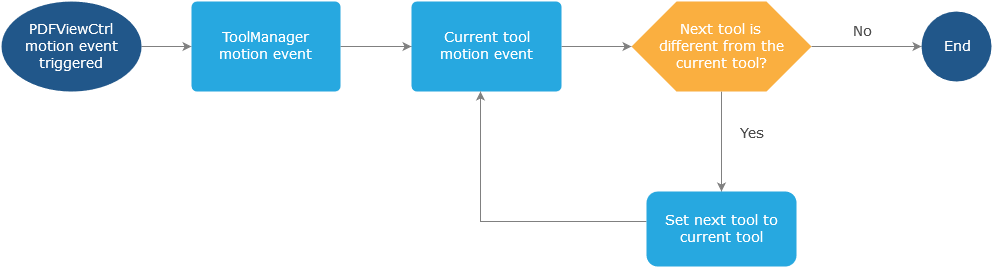

# Tool Overview

[Tool](http://neon.pdftron.local:8000/www/qliu/android/api/reference/com/pdftron/pdf/tools/Tool.html) class implements [ToolManager.Tool](http://neon.pdftron.local:8000/www/qliu/android/api/reference/com/pdftron/pdf/tools/ToolManager.Tool.html) for handling events passed from [ToolManager](http://neon.pdftron.local:8000/www/qliu/android/api/reference/com/pdftron/pdf/tools/ToolManager.html). When gesture event triggered on [PDFViewCtrl](http://neon.pdftron.local:8000/www/qliu/android/api/reference/com/pdftron/pdf/PDFViewCtrl.html), [ToolManager](http://neon.pdftron.local:8000/www/qliu/android/api/reference/com/pdftron/pdf/tools/ToolManager.html) passed the gesture events to the [Tool](http://neon.pdftron.local:8000/www/qliu/android/api/reference/com/pdftron/pdf/tools/Tool.html). If currently holded tool sets a different tool mode as next tool mode, after current tool gesture event finished, [ToolManager](http://neon.pdftron.local:8000/www/qliu/android/api/reference/com/pdftron/pdf/tools/ToolManager.html) will let the next tool to follow current gesture event.

[ToolManager](http://neon.pdftron.local:8000/www/qliu/android/api/reference/com/pdftron/pdf/tools/ToolManager.html) uses [Pan](http://neon.pdftron.local:8000/www/qliu/android/api/reference/com/pdftron/pdf/tools/Pan.html) tool as the default tool where handles almost all user events such as tapping on an annotation, long press to show quick menu, etc. When user tapped on an annotation, [Pan](http://neon.pdftron.local:8000/www/qliu/android/api/reference/com/pdftron/pdf/tools/Pan.html) tool changed to the other annotation handler tool so that tool can handle the tap event. For example, if Pan tool tapped on a [Link](https://www.pdftron.com/pdfnet/mobile/docs/Android/pdfnet/javadoc/reference/com/pdftron/pdf/annots/Link.html) annotation in in [`Pan.onSingleTapConfirmed(MotionEvent)`](http://neon.pdftron.local:8000/www/qliu/android/api/reference/com/pdftron/pdf/tools/Pan.html#onSingleTapConfirmed(android.view.MotionEvent)) event, then Pan tool will set the next tool to be [LinkAction](http://neon.pdftron.local:8000/www/qliu/android/api/reference/com/pdftron/pdf/tools/LinkAction.html) tool. The link annotaiton will be handled by LinkAction tool in [`LinkAction.onSingleTapConfirmed(MotionEvent)`](http://neon.pdftron.local:8000/www/qliu/android/api/reference/com/pdftron/pdf/tools/LinkAction.html#onSingleTapConfirmed(android.view.MotionEvent)) function.

The following example is how [Pan](http://neon.pdftron.local:8000/www/qliu/android/api/reference/com/pdftron/pdf/tools/Pan.html) tool switched to 