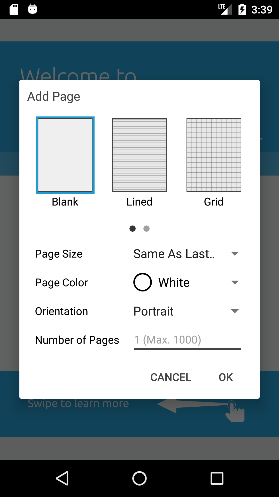

# Add page dialog

Add Page dialog allows users either to add new pages to an existing document or to create a new document with new pages. The new pages can have various page options including page type, page size and page color.

")



# Page options
There are three options for pages to be created:

### page type
Currently 5 different types of page are supported in this dialog:
- Black
- Lined
- Grid
- Graph
- Music

### page size
Currently the following page sizes are supported in this dialog:
- Same as last
- Letter
- Legal
- A4
- A3
- Ledger

Note that "Same as last" option is only available when new pages should be added to an existing PDF document but not when new document should be created. In this case the size of new pages is obtained from the existing document.

### page color 
Three colors can be selected for the page background:
- White
- Yellow
- Blueprint

## Implementation

To create a new instance of the add page dialog fragment call `newInstance()` and pass if you want to create a new document with new pages or you want to add new pages to an existing document. If new pages should be added into the current document, the valid page width and page height parameters should also be provided for cases where "Same as last" page size is selected. You should also implement `OnNewPageListener` and overrides the following methods
- `void onAddNewPage(Page)`: The implementation should add the given page to the current document.
- `void onAddNewPages(Page[])`: The implementation should add the given pages to the current document.
- `void onCreateNewDocument(PDFDoc, String)`: The implementation should create a new file with the given title filled out with the given PDF doc.

##### Example (when a new document should be created):
 ```java
AddPageDialogFragment addPageDialog = AddPageDialogFragment.newInstance(true, 0, 0);
addPageDialog.setListener(new AddPageDialogFragment.OnNewPageListener() {
    @Override
    public void onAddNewPage(Page page) {
        // shouldn't come here
    }

    @Override
    public void onAddNewPages(Page[] pages) {
        // shouldn't come here
    }

    @Override
    public void onCreateNewDocument(PDFDoc doc, String title) {
        if (doc == null || title == null) {
            return;
        }
        try {
            if (!FilenameUtils.isExtension(title, "pdf")) {
                title = title + ".pdf";
            }
            File documentFile = new File(mCurrentFolder, title);
            doc.save(documentFile.getAbsolutePath(), SDFDoc.e_remove_unused, null);
            doc.close();
        } catch (PDFNetException e) {
            e.printStackTrace();
        }
    }
});
addPageDialog.show(getFragmentManager(), "add_page_dialog");
 ```

##### Example (when new pages should be added to the current document):
```java
boolean shouldUnlockRead = false;
try {
    mPdfViewCtrl.docLockRead();
    shouldUnlockRead = true;
    Page lastPage = mPdfViewCtrl.getDoc().getPage(mPdfViewCtrl.getDoc().getPageCount());
    AddPageDialogFragment addPageDialog = AddPageDialogFragment.newInstance(false, lastPage.getPageWidth(), lastPage.getPageHeight());
    addPageDialog.setListener(new AddPageDialogFragment.OnNewPageListener() {
        @Override
        public void onAddNewPage(Page page) {
            if (page == null) {
                return;
            }
            Page[] pages = new Page[1];
            pages[0] = page;
            addNewPages(pages);
        }

        @Override
        public void onAddNewPages(Page[] pages) {
            addNewPages(pages)
        }

        void addNewPages(Page[] pages) {
            if (pages == null || mPdfViewCtrl == null) {
                return;
            }
            PDFDoc doc = mPdfViewCtrl.getDoc();
            if (doc == null) {
                return;
            }

            boolean shouldUnlock = false;
            try {
                mPdfViewCtrl.docLock(true);
                shouldUnlock = true;
                List<Integer> pageList = new ArrayList<>();
                for (int i = 1, cnt = pages.length; i <= cnt; i++) {
                    int newPageNum = mPdfViewCtrl.getCurrentPage() + i;
                    pageList.add(newPageNum);
                    doc.pageInsert(doc.getPageIterator(newPageNum), pages[i - 1]);
                }

                // For undo/redo support:
                ToolManager toolManager = (ToolManager) mPdfViewCtrl.getToolManager();
                if (toolManager != null) {
                    toolManager.raisePagesAdded(pageList);
                }
            } catch (Exception e) {
                e.printStackTrace();
            } finally {
                if (shouldUnlock) {
                    mPdfViewCtrl.docUnlock();
                }
                try {
                    mPdfViewCtrl.updatePageLayout();
                } catch (PDFNetException e) {
                    e.printStackTrace();
                }
            }
        }

        @Override
        public void onCreateNewDocument(PDFDoc doc, String title) {
            // shouldn't come here
        }
    });
    addPageDialog.show(getActivity().getSupportFragmentManager(), "add_page_dialog");
} catch (Exception e) {
    AnalyticsHandlerAdapter.getInstance().sendException(e);
} finally {
    if (shouldUnlockRead) {
        mPdfViewCtrl.docUnlockRead();
    }
}
```