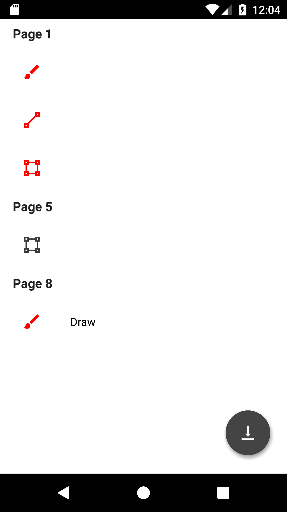

# Annotation dialog fragment

This class shows a list of all the annotations in a document being viewed by a PDFViewCtrl. The list will contain any comments that have been added to the annotations.



To create a new instance of the annotation dialog fragment call `newInstance()` and set the PDFViewCtrl: 
```android
AnnotationDialogFragment showAnnotationDialog(FragmentManager fragmentManager, PDFViewCtrl pdfViewCtrl) {
    AnnotationDialogFragment annotationDialogFragment = AnnotationDialogFragment.newInstance();
    annotationDialogFragment.setPdfViewCtrl(pdfViewCtrl);
    annotationDialogFragment.setStyle(DialogFragment.STYLE_NO_TITLE, R.style.CustomAppTheme);
    annotationDialogFragment.show(fragmentManager, "outline_dialog");
    return annotationDialogFragment;
}
```

You should set a listener via `setAnnotationDialogListener(AnnotationDialogListener)` to be notified when an annotation item is clicked, or when document annotations are exported to a PDF doc when users click on the export floating action button.

If the document has write access, users can delete existing annotations by long-pressing on the annotation. To specify whether the document is read-only call `setReadOnly(boolean)`.
