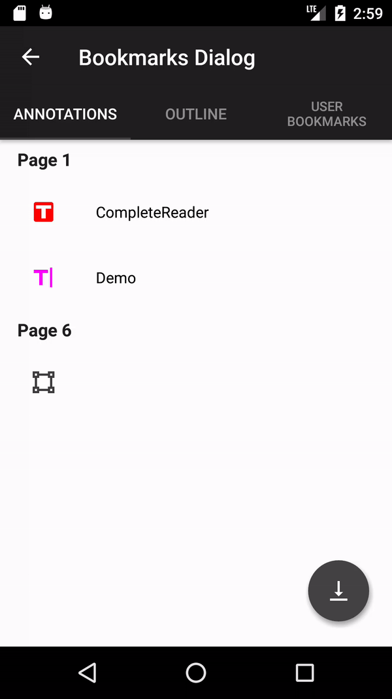

# Bookmarks dialog fragment

`BookmarksDialogFragment` provides a horizontal layout to display the following items in separate tabs:

   * user-defined bookmarks

   * document outline

   * annotations



To create a new instance of the bookmarks dialog fragment call
```android
BookmarksDialogFragment bookmarksDialogFragment = BookmarksDialogFragment.newInstance();
```
and setup the dialog:
```android
bookmarksDialogFragment.setPdfViewCtrl(pdfViewCtrl)
.setDialogFragmentTabs(dialogFragmentTabs);
```
where DialogFragmentTab specifies the information about each tab including the type of class and the tab tag.


| Dialog           | Type of class                    | Tab tag              |
|------------------|----------------------------------|----------------------|
| annotations      | AnnotationDialogFragment.class   | `TAG_TAB_ANNOTATION` |
| document outline | OutlineDialogFragment.class      | `TAG_TAB_OUTLINE`    |
| user bookmarks   | UserBookmarkDialogFragment.class | `TAG_TAB_BOOKMARK`   |

The following example shows how to display an annotations list, a document outline and a user-defined bookmark list tabs in BookmarksDialogFragment:

```android
BookmarksDialogFragment showBookmarksDialog(FragmentManager fragmentManager, PDFViewCtrl pdfViewCtrl) {
    DialogFragmentTab annotationsDialog = new DialogFragmentTab(
        AnnotationDialogFragment.class,
        BookmarksTabLayout.TAG_TAB_ANNOTATION,
        null,
        "Annotations",
        "Bookmarks Dialog",
        null);
    DialogFragmentTab outlineDialog = new DialogFragmentTab(
        UserBookmarkDialogFragment.class,
        BookmarksTabLayout.TAG_TAB_OUTLINE,
        null,
        "Outline",
        "Bookmarks Dialog",
        null);
    DialogFragmentTab userBookmarksDialog = new DialogFragmentTab(
        UserBookmarkDialogFragment.class,
        BookmarksTabLayout.TAG_TAB_BOOKMARK,
        null,
        "User Bookmarks",
        "Bookmarks Dialog",
        null);
    ArrayList<DialogFragmentTab> dialogFragmentTabs = new ArrayList<>();
    dialogFragmentTabs.add(annotationsDialog);
    dialogFragmentTabs.add(outlineDialog);
    dialogFragmentTabs.add(userBookmarksDialog);
    BookmarksDialogFragment bookmarksDialog = BookmarksDialogFragment.newInstance();
    bookmarksDialog.setPdfViewCtrl(pdfViewCtrl)
        .setDialogFragmentTabs(dialogFragmentTabs)
        .setBookmarksDialogListener(this)
        .setBookmarksTabsListener(this);
    bookmarksDialog.setStyle(DialogFragment.STYLE_NO_TITLE, R.style.CustomAppTheme);
    bookmarksDialog.show(fragmentManager, "bookmarks_dialog");
    return bookmarksDialog;
}

@Override
public void onBookmarksDialogDismissed(int tabIndex) {
    // the bookmarks dialog was dismissed
}

@Override
public void onUserBookmarkClick(int pageNum) {
    // a user bookmark was clicked
}

@Override
public void onOutlineClicked(Bookmark parent, Bookmark bookmark) {
    // an outline was clicked
}

@Override
public void onAnnotationClicked(Annot annotation, int pageNum) {
    // an annotation was clicked
}

@Override
public void onExportAnnotationsClicked() {
    // the export annotation button was clicked
}
```
