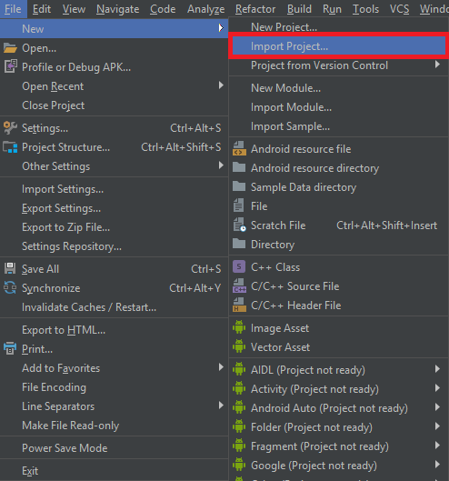
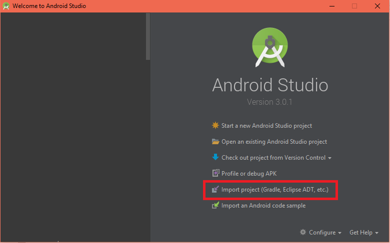
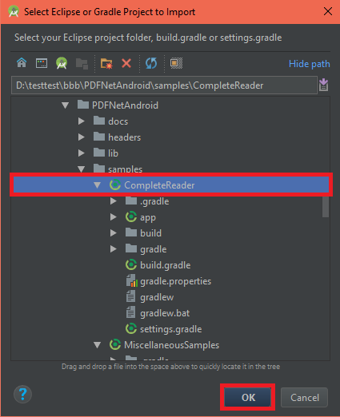
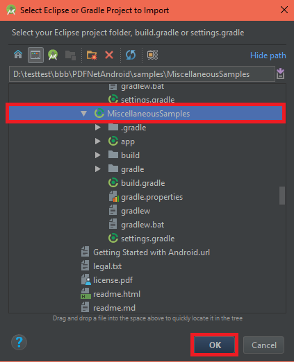
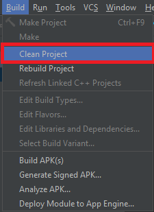
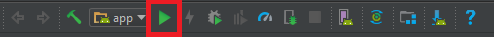

## How to run existing project with source code in Android Studio

If you don't have it, [download Android Studio](https://developer.android.com/studio/index.html). If you do have Android Studio, verify that it is the latest stable release by clicking **Help > Check for Updates** (on Mac, **Android Studio > Check for Updates**).

### Steps:

1. Start Android Studio and close any open Android Studio projects.
2. From the Android Studio menu click **File > New > Import Project**.

Alternatively, from the Welcome screen, click **Import project (Gradle, Eclipse ADT, etc.)**.

3. Select the project folder with the `settings.gradle` file and click **Ok**.

For CompleteReader:

For MiscellaneousSamples:

4. Clean the project by clicking **Build > Clean Project**

5. Run.

