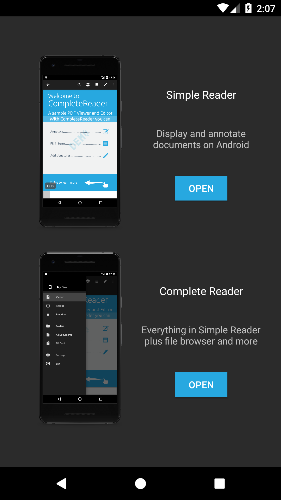

## Run sample projects

PDFNet ships with two sample projects each containing examples that you could use in your project. Both samples are included in the download package under `\samples` folder.

You can run any of the sample projects both via command line or via Android Studio.

Preparation:
First, add your PDFNet license key in your project's `gradle.properties` file:

```
PDFTRON_LICENSE_KEY=YOUR_PDFNET_LICENSE_KEY_GOES_HERE
```

Then, to deploy via command line, simply navigate to the root folder of the sample project of interest (i.e. `CompleteReader`, or `MiscellaneousSamples`), have one device or emulator running, then run the following command:

Windows:
```shell
.\gradlew.bat appStart
```

Linux:
```shell
gradle appStart
```

To deploy via Android Studio. See steps here:
[Run existing project in Android Studio](/android/guides/faq/run-in-android-studio).

### CompleteReader app



This sample can also be downloaded from `GITHUB-CLONE-LINK-GOES-HERE`.

This app contains two document viewing and editing Activities, `SimpleReaderActivity` and `CompleteReaderActivity`.

`SimpleReaderActivity` is an all-in-one document reader and PDF editor. In addition to PDF files, it also supports viewing of many file extensions such as `.docx`, `.doc`, `.pptx`, `.xlsx`, `.md`, `.cbz` and various image formats. It allows stream conversion of these non-pdf documents to PDF format so you can view the document while conversion happens. In this app, you can read, annotate, sign, share and fill in PDF forms.

`CompleteReaderActivity` has everything in `SimpleReaderActivity`, plus file browsers for local and SD card files. It has example for how you can implement recent and favorite files. It also demonstrates how to use document thumbnails. In addition, it supports file merging, new file creation from styles such as lined, grid, graph and music sheet.

Features:
- [User bookmarks](/android/guides/basics/user_bookmarks)
- [Outline](/android/guides/basics/outline)
- [Annotations list](/android/guides/basics/annotations)
- Sephia mode, night mode and custom color mode
- [Multi-tab viewing](/android/guides/getting-started/using_fragment)
- Page cropping
- [Reflow](/android/guides/basics/reflow)
- Full text search
- Annotation creation and form filling
- PDF creation
- PDF merging, splitting
- [Page thumbnails plus adding, removing, re-organizing, and rotating pages](/android/guides/basics/thumbnails_view)
- Localization

### MiscellaneousSamples app

This sample can also be downloaded from `GITHUB-CLONE-LINK-GOES-HERE`.

This app shows the functionalities of the PDFNet SDK and includes the samples found in the [sample code](http://www.pdftron.com/pdfnet/samplecode.html) page. Inspect its source code to learn how to use some of the main classes and features of the SDK, or just run the sample and check the results.
