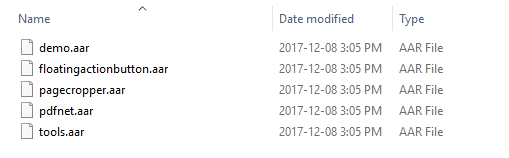

## Manually integrating PDFNet

In addition to integrating via gradle [Maven package manager](/android/guides/getting-started/integrate), you can also integrate manually by copying required `aar` files to your project. Typical usage of this is when trying out custom builds or nightly builds with latest hot fixes in your application.

1. Have PDFNetAndroid library zip bundle ready and extract it.
2. Copy either `lib/full/pdfnet.aar` or `lib/standard/pdfnet.aar` file directly into your project's `libs` directory (usually `app/libs`) without the folder structure. See [differences between the two versions here](/android/guides/faq/full-vs-standard).
3. Copy `lib/floatingactionbutton.aar`, `lib/pagecropper.aar`, and `lib/tools.aar` files directly into your project's `libs` directory.
4. (Optional) Copy `lib/demo.aar` file directly into your project's `libs` directory.

Now your `libs` folder will look like this:



5. Add the following in your root-level `build.gradle` repositories section.

```groovy
allprojects {
    repositories {
        ...
        flatDir {
            dirs 'libs'
        }
    }
}
```

Alternatively, you can add the following in your module Gradle file (usually `app/build.gradle`) dependencies section.

```groovy
dependencies {
    repositories {
        ...
        flatDir {
            dirs 'libs'
        }
    }
    ...
}
```

6. Include PDFNet as a dependency in your project. Add the following in your module Gradle file (usually `app/build.gradle`).

```groovy
dependencies {
    ...
    implementation "com.pdftron:pdfnet:6.8.0@aar"
    implementation "com.pdftron:tools:6.8.0@aar"
    implementation "com.pdftron:floatingactionbutton:1.0.0@aar"
    implementation "com.pdftron:pagecropper:1.0.0@aar"

    implementation "com.android.support:support-v4:26.1.0"
    implementation "com.android.support:appcompat-v7:26.1.0"
    implementation "com.android.support:recyclerview-v7:26.1.0"
    implementation "com.android.support:design:26.1.0"
    implementation "com.android.support.constraint:constraint-layout:1.1.0-beta3"
    implementation "android.arch.lifecycle:extensions:1.0.0-rc1"
}
```

If you added  `demo.aar`, then also add:

```groovy
dependencies {
    ...
    implementation "com.pdftron:demo:6.8.0@aar"
    implementation 'com.facebook.fresco:fresco:1.2.0'
}
```

And you are ready to start! Now time to open a [document in an Activity](/android/guides/getting-started/using-activity).
