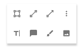
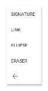
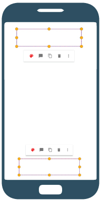

# Quick menu

A menu Layout that can be shown in [PDFViewCtrl](https://www.pdftron.com/pdfnet/mobile/docs/Android/pdfnet/javadoc/reference/com/pdftron/pdf/PDFDoc.html). It shows a small menu layout with maximum two rows, and a overflow menu list.





With a given anchor rectangle view, quick menu will auto adjust position, it will be shown in either at the top of the anchor view or at the bottom of the anchor view:



## Add Quick Menu
### Add a menu resource in `res/menu` folder
By default, all menu items are placed in the first row, if you want to specifies where the menu item is, you can simply put the menu items inside a group with the following group id.

####`@id/qm_first_row_group`

first row group id. All menu items inside this group will be displayed in first row of quick menu.

####`@id/qm_second_row_group`

second row group id. All menu items inside this group will be displayed in first row of quick menu.

####`@id/qm_overflow_row_group`

overflow list group id. All menu items inside this group will be displayed in overflow menu list of quick menu.

#### Example:
```xml
<?xml version="1.0" encoding="utf-8"?>
<menu xmlns:android="http://schemas.android.com/apk/res/android">
    <group android:id="@id/qm_first_row_group">
        <item android:id="@+id/qm_rectangle"
            android:title="@string/tools_qm_rectangle"
            android:icon="@drawable/annotation_square" />
    </group>
    <group android:id="@id/qm_second_row_group">
        <item android:id="@+id/qm_line"
            android:title="@string/annot_line"
            android:icon="@drawable/annotation_line"/>
        <item android:id="@+id/qm_free_text"
            android:title="@string/annot_free_text"
            android:icon="@drawable/annotation_free_text"/>
    </group>
    <group android:id="@id/qm_overflow_row_group">
        <item android:id="@+id/qm_floating_sig"
            android:title="@string/tools_qm_signature"/>
        <item android:id="@+id/qm_link"
            android:title="@string/annot_link"/>
    </group>
</menu>

```
### Inflate menu resource to quick menu
After creating a quick menu, quick menu can simply inflate menu resource and initialize menu items by calling [`quickMenu.initMenuEntries(@MenuRes int)`]().

#### Example
```java
    QuickMenu quickMenu = new QuickMenu(mPdfViewCtrl);
    quickMenu.initMenuEntries(R.menu.qm_resources);
```

Alternatively, If you want to change menu items before quick menu initialize them, you can call [`quickMenu.inflate(@MenuRes int)`](), so it won't auto initialize menu items. After adjusting menu items, you can call [`quickMenu.initMenuEntries()`]() to initialize menu items.

#### Example
```java
    QuickMenu quickMenu = super.createQuickMenu();
    quickMenu.inflate(R.menu.annot_simple_shape);
    QuickMenuItem noteItem = (QuickMenuItem) quickMenu.getMenu().findItem(R.id.qm_note);
    if (noteItem != null) {
        noteItem.setIcon(R.drawable.annotation_sticky_note);
        noteItem.setTitle(R.string.tools_qm_add_note);
    }
    quickMenu.initMenuEntries();
```

### Show quick menu

To set position of screen position of quick menu, call [`quickMenu.setAnchorRect(RectF)`](), and then call [`quickMenu.show()`]() to show the quick menu.

#### Example
```java
    quickMenu.setAnchorRect(anchor_rect);

    quickMenu.show();
```

*Additional tips:* If quick menu is controlled by your [customized tool](/android/guides/tools/custom-tool), you can creates your quick menu by overriding [`Tool.createQuickMenu()`]() function, calling [`Tool.showMenu(RectF)`]() will show the menu created by [`Tool.createQuickMenu()`]().


### Set quick menu item on click listener
You can set quick menu on item click listener as following:
```java
     quickMenu.setOnDismissListener(new QuickMenu.OnDismissListener() {
            @Override
            public void onDismiss() {
                // get selected quick menu item
                QuickMenuItem selectedMenuItem = quickMenu.getSelectedMenuItem();
            }
        });
```
- If your quick menu is controlled by your [custom tool](/android/guides/tools/custom-tool), you can simply overriding [`Tool.onQuickMenuClicked(QuickMenuItem)`]() in your custom tool.

- If your quick menu overrides existing Tool quick menu by 

## Customization

### Icons
Quick menu gets icons automatically based on menu item type in [QuickMenuConfig](./quick-menu-config.md). You can add customized icons by calling
```
QuickMenuConfing.getInstance().putIconMenuMap(String type, @DrawableRes int iconResId);
```
or
```
QuickMenuConfing.getInstance().putIconMenuMap(HashMap<String, Integer> iconMap);
```
See  [QuickMenuConfig](./quick-menu-config.md) for more details.

### Menu item color or style
- If you want to set a menu item icon color, you can set menuItem color by calling:
	```java
	menuItem.setIconColor(context.getColor(R.color.red));
	```
	See [QuickMenuItem](./quick-menu-item.md) for more details.
- If quick menu is already displayed, you can get menu item view by menu item type by calling:
	```java
    quickMenu.findButtonByMenuType(menuType);
    ```
    After that, you can customize the menu button view as normal View.
- Menu item buttons are using `R.style.Widget_Material_Button_Borderless` style, you can customize them by overriding it. 

### Background
Quick menu background is using `drawable/quickmenu_bg_rext.xml` for *API 21* and `drawable/quickmenu_bg_rect_old_api` for *API under 21*. You can change the background by overriding these drawable files.

### Divider
There is a hairline divider between menu first row and second row. By default, if both first row, and second row exist, divider is **VISIBLE**. You can set this hairline divider visibility by calling:
```java
quickMenu.setDividerVisibility(View.INVISIBLE);
```
