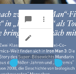
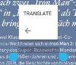

----
# Quick menu
----

A menu Layout that can be shown in [PDFViewCtrl](https://www.pdftron.com/pdfnet/mobile/docs/Android/pdfnet/javadoc/reference/com/pdftron/pdf/PDFDoc.html). It shows a small menu layout with maximum two rows, and a overflow menu list.


With a given anchor rectangle view, quick menu will auto adjust position, it will be shown in either at the top of the anchor view or at the bottom of the anchor view:


## Add Quick Menu

```
public void showMenu(Context context, PDFViewCtrl pdfViewCtrl, RectF anchor_rect) {
	ArrayList<QuickMenuItem> menuItems = new ArrayList<>();
    // add a menu item in first row of quick menu
    menuItems.add(new QuickMenuItem(Tool.QM_NOTE, "show notes", QuickMenuItem.FIRST_ROW_MENU));

    // add a menu item in second row of quick menu
    menuItems.add(new QuickMenuItem(Tool.QM_EDIT, "edit notes", QuickMenuItem.SECOND_ROW_MENU));

    // add a menu item in overflow list of quick menu
    menuItems.add(new QuickMenuItem(Tool.QM_TRANSLATE, "translate", QuickMenuItem.OVERFLOW_ROW_MENU));

    QuickMenu quickMenu = new QuickMenu(context, pdfViewCtrl, anchor_rect, menuItems);
    // show quick menu
    quickMenu.show();
    // .....
    // dismiss quick menu
    quickMenu.dismiss()
}

```
#### Result



## Customization

### Icons
Quick menu gets icons automatically based on menu item type in [QuickMenuConfig](./quick-menu-config.md). You can add customized icons by calling
```
QuickMenuConfing.getInstance().putIconMenuMap(String type, @DrawableRes int iconResId);
```
or
```
QuickMenuConfing.getInstance().putIconMenuMap(HashMap<String, Integer> iconMap);
```
See  [QuickMenuConfig](./quick-menu-config.md) for more details.

### Menu item color or style
- If you want to set a menu item icon color, you can set menuItem color by calling:
	```
	menuItem.setIconColor(context.getColor(R.color.red));
	```
	See [QuickMenuItem](./quick-menu-item.md) for more details.
- If quick menu is already displayed, you can get menu item view by menu item type by calling:
	```
    quickMenu.findButtonByMenuType(menuType);
    ```
    After that, you can customize the menu button view as normal View.
- Menu item buttons are using `R.style.Widget_Material_Button_Borderless` style, you can customize them by overriding it. 

### Background
Quick menu background is using `drawable/quickmenu_bg_rext.xml` for *API 21* and `drawable/quickmenu_bg_rect_old_api` for *API under 21*. You can change the background by overriding these drawable files.

### Divider
There is a hairline divider between menu first row and second row. By default, if both first row, and second row exist, divider is **VISIBLE**. You can set this hairline divider visibility by calling:
```
quickMenu.setDividerVisibility(View.INVISIBLE);
```
