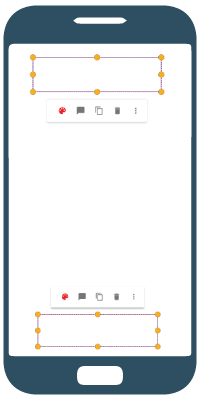

# Quick menu

A menu Layout that can be shown in [PDFViewCtrl](https://www.pdftron.com/pdfnet/mobile/docs/Android/pdfnet/javadoc/reference/com/pdftron/pdf/PDFDoc.html). It shows a small menu layout with maximum two rows, and a overflow menu list. 

 

With a given anchor rectangle view, quick menu will auto adjust position, it will be shown in either at the top of the anchor view or at the bottom of the anchor view: 

## Add Quick Menu
### Add a menu resource in `res/menu` folder
By default, all menu items are placed in the first row, if you want to specifies where the menu item is, you can simply put the menu items inside a group with the following group id.

####`@id/qm_first_row_group`

first row group id. All menu items inside this group will be displayed in first row of quick menu.

####`@id/qm_second_row_group`

second row group id. All menu items inside this group will be displayed in first row of quick menu.

####`@id/qm_overflow_row_group`

overflow list group id. All menu items inside this group will be displayed in overflow menu list of quick menu.

##### Example:
```xml
<?xml version="1.0" encoding="utf-8"?>
<menu xmlns:android="http://schemas.android.com/apk/res/android">
    <group android:id="@id/qm_first_row_group">
        <item android:id="@+id/qm_rectangle"
            android:title="@string/tools_qm_rectangle"
            android:icon="@drawable/annotation_square" />
    </group>
    <group android:id="@id/qm_second_row_group">
        <item android:id="@+id/qm_line"
            android:title="@string/annot_line"
            android:icon="@drawable/annotation_line"/>
        <item android:id="@+id/qm_free_text"
            android:title="@string/annot_free_text"
            android:icon="@drawable/annotation_free_text"/>
    </group>
    <group android:id="@id/qm_overflow_row_group">
        <item android:id="@+id/qm_floating_sig"
            android:title="@string/tools_qm_signature"/>
        <item android:id="@+id/qm_link"
            android:title="@string/annot_link"/>
    </group>
</menu>

```
### Inflate menu resource to quick menu
After creating a quick menu, quick menu can simply inflate menu resource and initialize menu items by calling [`quickMenu.initMenuEntries(@MenuRes int)`]().

##### Example
```java
    QuickMenu quickMenu = new QuickMenu(mPdfViewCtrl);
    quickMenu.initMenuEntries(R.menu.qm_resources);
```

Alternatively, If you want to change menu items before quick menu initialize them, you can call [`quickMenu.inflate(@MenuRes int)`](), so it won't auto initialize menu items. After adjusting menu items, you can call [`quickMenu.initMenuEntries()`]() to initialize menu items.

##### Example
```java
    QuickMenu quickMenu = new QuickMenu(mPdfViewCtrl);
    quickMenu.inflate(R.menu.annot_simple_shape);
    QuickMenuItem noteItem = (QuickMenuItem) quickMenu.getMenu().findItem(R.id.qm_note);
    if (noteItem != null) {
        noteItem.setIcon(R.drawable.annotation_sticky_note);
        noteItem.setTitle(R.string.tools_qm_add_note);
    }
    quickMenu.initMenuEntries();
```

### Show quick menu

To set position of screen position of quick menu, call [`quickMenu.setAnchorRect(RectF)`](), and then call [`quickMenu.show()`]() to show the quick menu.

##### Example
```java
    quickMenu.setAnchorRect(anchor_rect);

    quickMenu.show();
```

### Get quick menu clicked menu item
When quick menu item is clicked, it will dismiss the quick menu popup. You can set a dismiss listener and get the selected menu item as following:
```java
    quickMenu.setOnDismissListener(new QuickMenu.OnDismissListener() {
        @Override
        public void onDismiss() {
            // get selected quick menu item
            QuickMenuItem selectedMenuItem = quickMenu.getSelectedMenuItem();
        }
    });
```

####*Additional Tips:*
- If your quick menu is controlled by your [custom tool](/android/guides/tools/custom-tool), you can simply overriding [`Tool.onQuickMenuClicked(QuickMenuItem)`]() in your custom tool to listen to quick menu click event.

- If you overrides existing Tool quick menu resource, you can either:
    - If you are using PdfViewCtrlTabFragment for showing pdf, then add quick menu listener by calling: [`PdfViewCtrlTabFragment.addQuickMenuListener(ToolManager.QuickMenuListener)`]().
    - Or you can call [`ToolManager.setQuickMenuListener(ToolManager.QuickMenuListener)`]()

## Customization

### Quick menu item icons

In xml menu resource file, you can set menu item icon by `android:icon`. For set icon style, you can simply sets quick menu item icon by adding `android:iconTint` and icon tint mode by adding `android:iconTintMode` in your menu resource xml file if you supports *API 26*.

##### Example:
```xml
<item android:id="@+id/qm_rectangle"
    android:title="@string/tools_qm_rectangle"
    android:icon="@drawable/annotation_square"
    android:iconTint="@color/fab_dark_blue"
    android:iconTintMode="src_in"/>
```

You can also set quick menu item icon programmably before quick menu initialize them by [`quickMenuItem.setIcon(Drawable)`]() or [`quickMenuItem.setIcon(int)`](). For icon style, you can set icon color by [`quickMenuItem.setIconColor(int)`](), and icon opacity by [`quickMenuItem.setIconOpacity(float)`]().

##### Example:
```java
    QuickMenu quickMenu = new QuickMenu(mPdfViewCtrl);
    quickMenu.inflate(R.menu.annot_simple_shape);
    QuickMenuItem noteItem = (QuickMenuItem) quickMenu.getMenu().findItem(R.id.qm_note);
    if (noteItem != null) {
        noteItem.setIcon(R.drawable.annotation_sticky_note);
        noteItem.setIconColor(mContext.getResources().getColor(R.color.red));
        noteItem.setIconOpacity(0.87);
    }
    quickMenu.initMenuEntries();
```
### Quick menu buttons style
Quick menu is using `R.style.QuickMenuButton` for the buttons style. You can change the style by overriding it.

If you want to change the button style after quick menu is displayed, you can find the button by calling [`quickMenu.findButtonByMenuItem(QuickMenuItem)`](). After that, you can set button style programmably depends on if it is a [ImageButton](https://developer.android.com/reference/android/widget/ImageButton.html) or a [Button](https://developer.android.com/reference/android/widget/Button.html).

##### Example:
```java
    /**
     * Update quick menu appearance item color
     * @param color
     */
    public void updateQuickMenuStyleColor(int color) {
        if (mQuickMenu == null) {
            return;
        }
        // find appearance quick menu item
        QuickMenuItem menuItem = (QuickMenuItem) mQuickMenu.getMenu().findItem(R.id.qm_appearance);
        if (menuItem != null) {
            menuItem.setIconColor(color);
            View button = mQuickMenu.findButtonByMenuItem(menuItem);
            if (button != null) {
                if (button instanceof ImageButton) {
                    ((ImageButton) button).setColorFilter(color, PorterDuff.Mode.SRC_IN);
                } else if (button instanceof Button) {
                    ((Button) button).setTextColor(color);
                }
            }
        }
    }
```

### Background
Quick menu background is using `drawable/quickmenu_bg_rext.xml` for *API 21* and `drawable/quickmenu_bg_rect_old_api` for *API under 21*. You can change the background by overriding these drawable files.

### Divider
There is a hairline divider between menu first row and second row. By default, if both first row and second row exist, divider is **VISIBLE**. You can set this hairline divider visibility by calling:
```java
quickMenu.setDividerVisibility(View.INVISIBLE);
```
