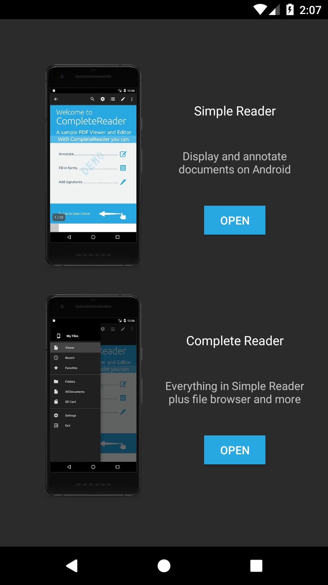

## Run sample projects

PDFNet ships with three sample projects each containing examples that you could use in your project.

### CompleteReader app

This app can be downloaded from `GITHUB-CLONE-LINK-GOES-HERE`.

This app contains two main Activities, Simple Reader and Complete Reader.

Simple Reader is an all-in-one document reader and PDF editor. In addition to PDF files, it also supports viewing of many file extensions such as `.docx`, `.doc`, `.pptx`, `.xlsx`, `.md`, `.cbz` and various image formats. It allows stream conversion of these non-pdf documents to PDF format so you can view the document while conversion happens. In this app, you can read, annotate, sign, share and fill in PDF forms.

Complete Reader has everything in Simple Reader, plus file browsers for local and SD card files. It has example for how you can implement recent and favorite files. It also demonstrates how to use document thumbnails. In addition, it supports file merging, new file creation from styles such as lined, grid, graph and music sheet.

Features: (TODO: link to actual tutorial):
- Bookmark
- Outline
- Annotation list
- Sephia mode, night mode and custom color mode
- Multi-tab viewing
- Page cropping
- Reflow
- Full text search
- Annotation creation and form filling
- PDF merging, splitting
- Page re-organizing, rotation
- Localization

### MiscellaneousSamples app

This app can be downloaded from `GITHUB-CLONE-LINK-GOES-HERE`.

This app shows the functionalities of the PDFNet SDK and includes the samples found in the [sample code](http://www.pdftron.com/pdfnet/samplecode.html) page. Inspect its source code to learn how to use some of the main classes and features of the SDK, or just run the sample and check the results.

### PDFDrawDemo app

This app can be downloaded from `GITHUB-CLONE-LINK-GOES-HERE`.

This app is a simple example that shows how PDFDraw can be used to make a simple PDF viewer. Tap top (bottom) half of the viewer to turn pages backward (forward).