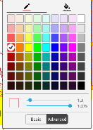
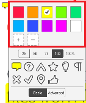
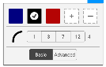
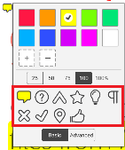

# Customize Tool Style
When creating annotation, each annotation creator tool has a default color and presets. These default color are defined in styles and can be easily customized by overriding the styles.

## Default Styles Attributes
### annot_color:
default color when creating annotation

format: color

### annot_color_2:
default color option 2, often used in color presets, for example, annotation toolbar of **ink** tool has 5 presets, they are defined in [annot_color_2](#annot_color_2), [annot_color_3](#annot_color_3), [annot_color_4](#annot_color_4), [annot_color_5](#annot_color_5), 

format: color

### annot_color_3:
default color option 3, often used in color presets

format: color

### annot_color_4:
default color option 4, often used in color presets

format: color

### annot_color_5:
default color option 5, often used in color presets

format: color

### annot_font_size:
default anotation font size, used in [ToolManager.e_text_create]() tool

format: int

### annot_thickness:
default thickness

format: float

### annot_thickness_max:
default maximum thickness

format: float

### annot_thickness_min:
default minimum thickness

format: float

### annot_font:
default font

format: string

### annot_opacity:
default annotation opacity

format: float

### annot_icon:
default annotation icon, used in [ToolManager.e_text_annot_create]() tool

format: float

## Customize style
### Overriding existing style
The following table are default exisitng styles for corresponding tool:

| Tool                                | style resource                       |
|-------------------------------------|--------------------------------------|
| [ToolManager.e_text_highlight]()    | R.style.HighlightAnnotationProperty  |
| [ToolManager.e_text_underline]()    | R.style.TextMarkupAnnotationProperty |
| [ToolManager.e_text_strikeout]()    | R.style.TextMarkupAnnotationProperty |
| [ToolManager.e_text_squiggly]()     | R.style.TextMarkupAnnotationProperty |
| [ToolManager.e_rect_link]()         | R.style.TextMarkupAnnotationProperty |
| [ToolManager.e_text_create]()       | R.style.FreeTextAnnotationProperty   |
| [ToolManager.e_text_annot_create]() | R.style.NoteAnnotationProperty       |
| [ToolManager.e_signature]()         | R.style.SignaturetAnnotationProperty |
| [ToolManager.e_ink_create]()        | R.style.FreehandAnnotationProperty   |
| other                               | R.style.ShapeAnnotationProperty      |
#### Override example:
This example will override the color presets for [ToolManager.e_ink_create]() tool
```
<style name="FreehandAnnotationProperty" parent="ShapeAnnotationProperty">
    <item name="annot_color">@color/xodo_light_blue</item>
    <item name="annot_color_2">@color/page_number_indicator_bg</item>
    <item name="annot_color_3">@color/red</item>
    <item name="annot_color_4">@color/orange</item>
    <item name="annot_color_5">@color/purple</item>
</style>
```

### Add Customize Tool default style
You can also add your customized tool default style resource to [ToolStyleConfig]() as following:
```
ToolStyleConfig.getInstance().addDefaultStyleMap(ToolManager.e_rect_create, R.style.rectangle_style);
```

## Customize color in tool color picker board

Color picker board style are located in `res/values/arrays.xml`, you can customize them by overriding them.

### Standard colors
Used in the color picker **Basic** page.


resource name: `R.array.standard_colors`

### Advance colors
Used in the color picker **Advanced** page with more colors.



resource name: `R.array.advance_colors`

### Icon colors
Used for [StickyNote](https://www.pdftron.com/pdfnet/mobile/docs/Android/pdfnet/javadoc/reference/com/pdftron/pdf/annots/Text.html) annotation to change sticky note icon color.



resource name: `R.array.icon_colors`

### Signature colors
Used for changing colors for [Signature]() tool.



resource name: `R.array.signature_colors`

### Sticky note icons
Used for selecting icons for [StickyNote](https://www.pdftron.com/pdfnet/mobile/docs/Android/pdfnet/javadoc/reference/com/pdftron/pdf/annots/Text.html) annotation. For each annotation icon, it stores two identical icons, one for filling color, the other one for outline.



resource name: `R.array.stickynote_icons`

Corresponding drawable resource: `R.drawable.annotaiton_note_icon_{$icon-name}_fill` and `R.drawable.annotation_note_icon_{$icon-name}_outline`


