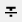

# Quick Menu Config

A Configuration for quick menu type and icon pair.

## Basic example:
### get icon resource id by menu type:
```
QuickMenuConfig.getInstance().getMenuIconId("appearance");
```
### get customized Icon resource id only by menu type:
```
QuickMenuConfig.getInstance().getMenuIconId("appearance", false);
```
### add a customized menu type and icon pair:
```
QuickMenuConfig.getInstance().putIconMenuMap("appearance", R.drawable.ic_android);
```
### add entire customized menu type and icon set:
```
HashMap<String, Integer> map = new HashMap<>();
map.put("appearance", R.drawable.ic_android);
QuickMenuConfig.getInstance().putIconMenuMap(map);
```

## Default menu type and icon set:
| Type                      | Icon ResourceId                              | Icon                                             |
|---------------------------|----------------------------------------------|--------------------------------------------------|
| [Tool.QM_APPEARANCE]()    | R.drawable.ic_color_lens_black_24dp          |           |
| [Tool.QM_HIGHLIGHT]()     | R.drawable.annotation_highlight              |               |
| [Tool.QM_UNDERLINE]()     | R.drawable.annotation_underline              |               |
| [Tool.QM_NOTE]()          | R.drawable.annotation_sticky_note            |             |
| [Tool.QM_STICKY_NOTE]()   | R.drawable.annotation_sticky_note            |             |
| [Tool.QM_STRIKEOUT]()     | R.drawable.annotation_strikeout              |               |
| [Tool.QM_SQUIGGLY]()      | R.drawable.annotation_squiggly               |                |
| [Tool.QM_LINK]()          | R.drawable.ic_link_black_24dp                |                 |
| [Tool.QM_SIGNATURE]()     | R.drawable.annotation_signature              |               |
| [Tool.QM_FLOATING_SIG]()  | R.drawable.annotation_signature              |               |
| [Tool.QM_STAMPER]()       | R.drawable.annotation_stamper                |                 |
| [Tool.QM_FREEHAND]()      | R.drawable.annotation_free_hand              |               |
| [Tool.QM_INK_ERASER]()    | R.drawable.annotation_eraser                 |                  |
| [Tool.QM_FREE_TEXT]()     | R.drawable.annotation_free_text              |               |
| [Tool.QM_LINE]()          | R.drawable.annotation_line                   |                    |
| [Tool.QM_ARROW]()         | R.drawable.annotation_arrow                  |                   |
| [Tool.QM_RECTANGLE]()     | R.drawable.annotation_square                 |                  |
| [Tool.QM_OVAL]()          | R.drawable.annotation_circle                 |                  |
| [Tool.QM_TRANSLATE]()     | R.drawable.ic_translate_black_24dp           |            |
| [Tool.QM_EDIT]()          | R.drawable.ic_edit_black_24dp                |                 |
| [Tool.QM_SEARCH]()        | R.drawable.ic_search_black_24dp              |               |
| [Tool.QM_SHARE]()         | R.drawable.ic_share_black_24dp               |                |
| [Tool.QM_OPEN]()          | R.drawable.ic_arrow_forward_black_24dp       |        |
| [Tool.QM_DELETE]()        | R.drawable.ic_delete_black_24dp              |               |
| [Tool.QM_OVERFLOW_MENU]() | R.drawable.ic_more_vert_black_24dp           |            |
| [Tool.QM_DEFINE]()        | R.drawable.ic_dictionary                     |                      |
| [Tool.QM_COPY]()          | R.drawable.ic_content_copy_black_24dp        |         |
| [Tool.QM_TTS]()           | R.drawable.ic_play_circle_outline_black_24dp |  |
| [Tool.QM_PASTE]()         | R.drawable.ic_content_paste_black_24dp       |        |
| [Tool.QM_TYPE]()          | R.drawable.annotation_type                   |                    |
| [AnnotEdit.QM_ROTATE]()   | R.drawable.ic_rotate_right_black_24dp        |         |
| [AnnotEdit.QM_TEXT]()     | R.drawable.ic_edit_black_24dp                |                 |
