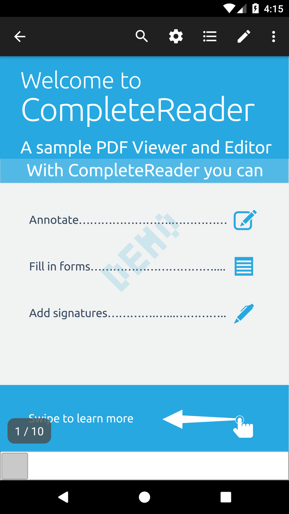
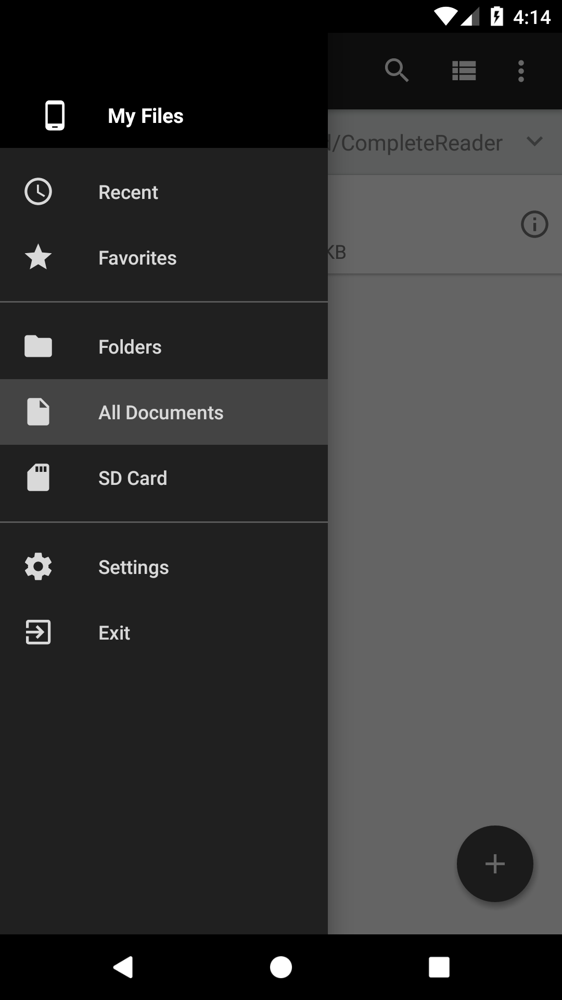

## Try the PDFNet Demo in your application

To try the PDFNet demo Activities in one of your own projects, here are a few simple steps to prepare your Android Studio project.

First, add rules to your root-level `build.gradle` file, to include PDFNet's Maven repository:

```
allprojects {
    ...
    repositories {
        ...
        maven {
            url "s3://pdfnet-maven/release"
            credentials(AwsCredentials) {
                accessKey AWS_ACCESS_KEY
                secretKey AWS_SECRET_KEY
            }
        }
        maven { url 'https://jitpack.io' }
    }
}
```

Add the credentials in your project's `gradle.properties` file:

```
AWS_ACCESS_KEY=<YOUR_ACCESS_KEY_GOES_HERE>
AWS_SECRET_KEY=<YOUR_SECRET_KEY_GOES_HERE>
PDFTRON_LICENSE_KEY=<YOUR_PDFNET_LICENSE_KEY_GOES_HERE>
```

Then, in your module Gradle file (usually `app/build.gradle`), add:

```
android {
    defaultConfig {
        ...
        vectorDrawables.useSupportLibrary = true
        manifestPlaceholders = [pdftronLicenseKey:PDFTRON_LICENSE_KEY]
    }
    configurations.all {
        resolutionStrategy.force "com.android.support:appcompat-v7:26.1.0"
        resolutionStrategy.force "com.android.support:support-v4:26.1.0"
    }
}

dependencies {
    ...
    implementation "com.pdftron:pdfnet:6.8.0"
    implementation "com.pdftron:tools:6.8.0"
    implementation "com.pdftron:demo:1.0.0"
}
```

Next, add permissions to `AndroidManifest.xml` file outside of the `<application/>` tag:

```
<uses-permission android:name="android.permission.INTERNET"/>
<uses-permission android:name="android.permission.ACCESS_NETWORK_STATE"/>
<uses-permission android:name="android.permission.WRITE_EXTERNAL_STORAGE" />
<uses-permission android:name="android.permission.VIBRATE"/>

```

Next, add license key placeholder, activity declarations to `AndroidManifest.xml` file inside the `<application/>` tag:

```
<meta-data
  android:name="pdftron_license_key"
  android:value="${pdftronLicenseKey}"/>

<activity android:name="com.pdftron.demo.app.SimpleReaderActivity"
    android:configChanges="keyboardHidden|orientation|screenSize|screenLayout|smallestScreenSize"
    android:windowSoftInputMode="adjustPan"
    android:theme="@style/CustomAppTheme"/>

<activity android:name="com.pdftron.demo.app.CompleteReaderActivity"
    android:configChanges="keyboardHidden|orientation|screenSize|screenLayout|smallestScreenSize"
    android:windowSoftInputMode="adjustPan"
    android:theme="@style/CustomAppTheme"/>

<activity android:name="com.pdftron.demo.app.SettingsActivity"
    android:parentActivityName="com.pdftron.demo.app.CompleteReaderActivity"
    android:theme="@style/CustomAppTheme" />

```

Finally, add style to `res/values/styles.xml`:

```
<style name="CustomAppTheme" parent="Theme.AppCompat.Light.NoActionBar">
    <item name="colorPrimary">@color/app_color_primary</item>
    <item name="colorPrimaryDark">@color/app_color_primary_dark</item>
    <item name="colorAccent">@color/app_color_accent</item>
    <!--Drawer-->
    <item name="drawerArrowStyle">@style/DrawerArrowStyle</item>
    <item name="windowActionModeOverlay">true</item>
</style>
```

To open Simple Reader demo, use:
```
import com.pdftron.demo.app.SimpleReaderActivity;
...
SimpleReaderActivity.open(this);
```

You will see:



To open Complete Reader demo, use:
```
import com.pdftron.demo.app.CompleteReaderActivity;
...
CompleteReaderActivity.open(this);
```

You will see:

