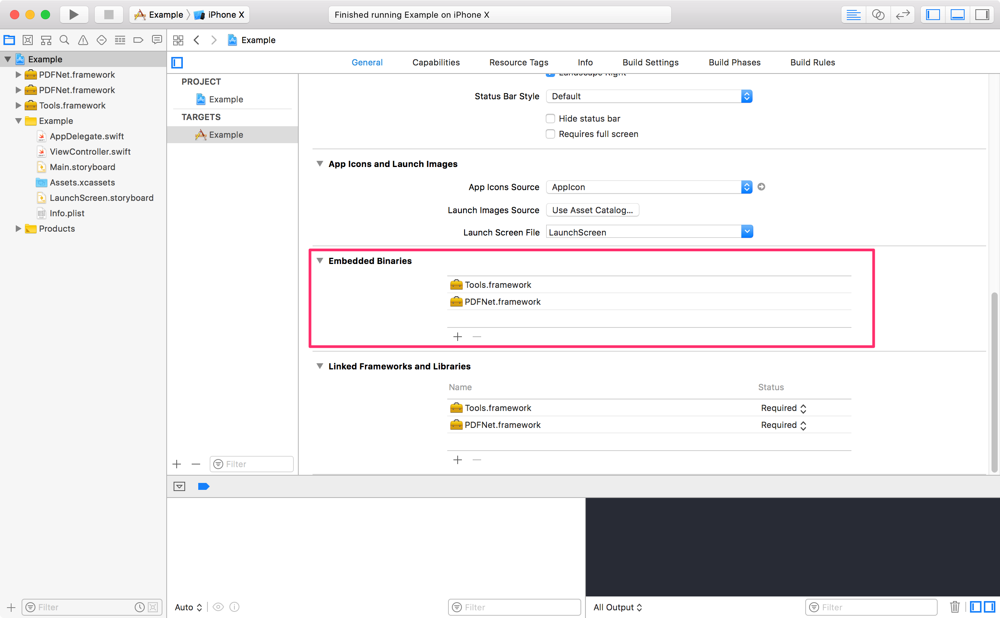
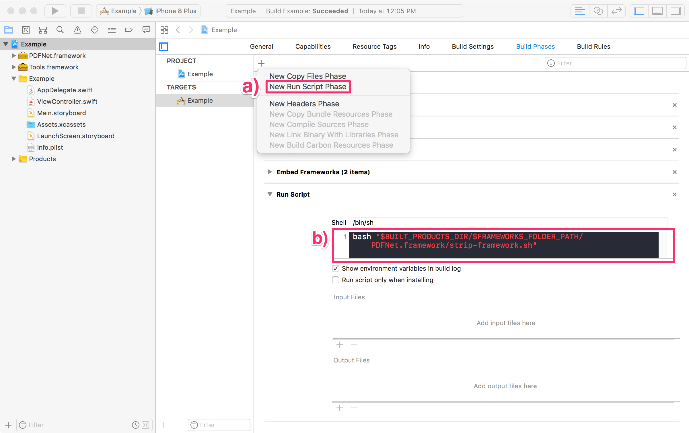

## Integration

There are two ways to integrate PDFNet with an app: [manually](./index.html#Manual-Integration-(Dynamic-Framework)), using [Cocoapods](./index.html#Cocoapods-Integration), and using [Carthage](./index.html#Carthage-Integration). The package managers all integrate the dynamic framework. If you wish to use the static framework, you will have to integrate it manually.

The manual download includes sample projects and source code for the UI framework; the package manager methods include only the framework binaries.

All three methods require a [trial license key](https://www.pdftron.com/pdfnet/mobile/request_trial.html) (or a commercial key), so please make sure you have one ready before proceeding.

### Manual Integration (Dynamic Framework)


1. If you have not already done so, please [obtain a trial license key](https://www.pdftron.com/pdfnet/mobile/request_trial.html) (or have a copy of your commerical key ready), which will be needed to intialize PDFNet.
2. Download the PDFNet DMG from the link provided in the trial email.
3. Copy the `/Lib` directory to an appopriate location for your project.
4. Drag the dynamic PDFNet and Tools frameworks (`Lib/Framework-dynamic/PDFNet.framework`, `Lib/Tools/Tools.framework`) into the "Embedded Binaries" section of your project, as indicated below.

      
    _The pink rectangle shows where to drag `PDFNet.framework` and `Tools.framework`_ 

5. In your target's build phases, a) add a new run script phase (by clicking on the '+'), and b) add the script ```bash "$BUILT_PRODUCTS_DIR/$FRAMEWORKS_FOLDER_PATH/PDFNet.framework/strip-framework.sh"```. This will ensure invalid slices are striped from the framework before being submitted to the app store (a [longstanding Xcode bug](http://www.openradar.me/radar?id=6409498411401216)).

    
    _Create a new run script phase, and add the text as shown._

### Cocoapods Integration

PDFNet is available via [Cocoapods](https://www.cocoapods.com/).

To add PDFNet to your project, include the following in your pod file:

```
target '<Your-Target-Name>' do
  use_frameworks!
  pod 'PDFNet', podspec: '<PDFNet-podspec-link>'
end
```
_`<Your-Target-Name>` is your Xcode project's target name, and `<PDFNet-podspec-link>` is the link that is provided in your evaluation email._

Your evaluation email will have four different `<PDFNet-podspec-link>` links:  

The first two links include both `PDFNet.framework` and a binary copy of the UI framework, `Tools.framework`. One link references the latest release, and the other references a specific version.

In case you are using a customized version of the open-source UI framework, `Tools.framework`, we provide two links that include only `PDFNet.framework`. One link references the latest release, and the other references a specific version.

### Carthage Integration

[Carthage](https://github.com/Carthage/Carthage) integration includes the `PDFNet.framework` and a binary version of the open-source UI framework, `Tools.framework`. The Carthage package does not include sample code or source code for the UI framework `Tools.framework` — please use the manual download to get these.

To add PDFNet with Carthage, add one of the links you received in your evaluation email in your Cartfile, and then follow Carthage's [instructions](https://github.com/Carthage/Carthage/blob/master/README.md#if-youre-building-for-ios-tvos-or-watchos) to finish integrating.