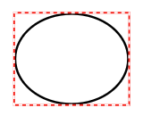

WebViewer supports client side user permissions for annotations to control which users can modify which annotations. By default users can only modify annotations that they have created but there are a number of ways that this can be customized if you wish.

### Default behavior
When WebViewer is instantiated it sets the current user name to be the value of the `annotationUser` option in the WebViewer constructor. If this option isn't specified then the user's name is set to "Guest". After WebViewer has been instantiated you can also programmatically set the current user name using the [`setAnnotationUser`](https://www.pdftron.com/webviewer/demo/doc/symbols/PDFTron.WebViewer.html#setAnnotationUser__anchor) function on the WebViewer instance.

When the user creates a new annotation, the [annotation's Author property](https://www.pdftron.com/webviewer/demo/lib/html5/doc/symbols/Annotations.Annotation.html) will be set to the current user name. The user will be able to modify or delete any annotations that have an Author value equal to their user name and these annotations will have a blue border when selected. The user will also be able to update the text on the note associated with the annotation.


Any annotations that have a different Author value will be displayed with a red border when selected and the user will not be able to modify or delete them. They will also not be able to modify the note text but they will be able to add replies.


### Admin users
WebViewer has an `annotationAdmin` boolean option that can be passed to the WebViewer constructor. When set to true the user is considered to be an administrator and is able to modify and delete any annotation or message regardless of the user that created it. You can programmatically toggle this property for the current user by calling [`setAdminUser`](https://www.pdftron.com/webviewer/demo/doc/symbols/PDFTron.WebViewer.html#setAdminUser__anchor).

### Readonly mode
There is also an `enableReadOnlyMode` boolean option that puts WebViewer into readonly mode. When in readonly mode annotations cannot be created, modified or deleted and no replies can be added to any annotation messages. You can programmatically toggle this mode by calling [`setReadOnly`](https://www.pdftron.com/webviewer/demo/doc/symbols/PDFTron.WebViewer.html#setReadOnly__anchor).

### Annotation properties
There are [several properties](https://www.pdftron.com/webviewer/demo/lib/html5/doc/symbols/Annotations.Annotation.html#Annotation__anchor) that individual annotations can have that affect whether an annotation can be edited or not.
- **ReadOnly**: Neither the annotation nor the annotation's note can be deleted or modified.
- **Locked**: The annotation cannot be deleted or modified but the annotation's note can be changed.
- **LockedContents**: The annotation can be deleted or modified but the annotation's note cannot be changed.

### Custom permissions
You can define your own logic for whether an annotation can be modified or not using the [setPermissionCheckCallback function on AnnotationManager](https://www.pdftron.com/webviewer/demo/lib/html5/doc/symbols/CoreControls.AnnotationManager.html#setPermissionCheckCallback__anchor).

This function takes a callback function that you define that should return true if the current user should have permission to modify the annotation and false otherwise. For example:
```javascript
$(document).on('viewerLoaded', function() {
  var annotManager = readerControl.docViewer.getAnnotationManager();
  annotManager.setPermissionCheckCallback(function(author, annotation) {
    // the default permission check that is used
    // you can combine this with your own custom checks
    var defaultPermission = annotation.Author === annotManager.getCurrentUser();
    // any annotation with 50% opacity will also be editable regardless of the author
    var customPermission = annotation.Opacity === 0.5;

    return defaultPermission || customPermission;
  });
});
```